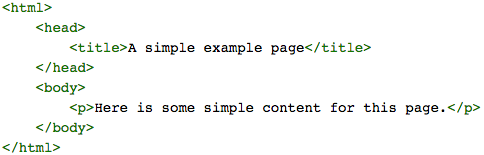

# Data Preprocessing
Basic imports
%matplotlib inline
import numpy as np # linear algebra
import pandas as pd # data processing, CSV file I/O (e.g. pd.read_csv)
from datetime import timedelta
import datetime as dt
import matplotlib.pyplot as plt
plt.rcParams['figure.figsize'] = [16, 10]
import seaborn as sns
import xgboost as xgb
from sklearn.model_selection import train_test_split
from sklearn.decomposition import PCA
from sklearn.cluster import MiniBatchKMeans
import warnings
warnings.filterwarnings('ignore')
Create a dataframe - dirty way
df = pd.DataFrame(np.random.randn(7, 3))
data = pd.DataFrame(np.arange(12).reshape((3, 4)),index=['Ohio', 'Colorado', 'New York'], columns=['one', 'two', 'three', 'four'])
............................................................................

# DATA SELECION
In a general way, if you want to pick up the first N rows from the J column from pandas dataframe the best way to do this is:

data = dataframe[0:N]["J"] where J is the column name

# Only pull non NaN rows from a df- here we are pulling all the rows with no NAN under respondent ID columns
star_wars=star_wars[pd.notnull(star_wars["RespondentID"])]

...
## NA handling methods
dropna Filter axis labels based on whether values for each label have missing data, with varying thresholds for how
much missing data to tolerate.

example: data.dropna(),data.dropna(how='all'), data.dropna(axis=1,how='all')

fillna Fill in missing data with some value or using an interpolation method such as 'ffill' or 'bfill'.
df.fillna(0)
df.fillna(method='ffill')
if data is a series, data.fillna(data.mean())

isnull Return boolean values indicating which values are missing/NA.

notnull Negation of isnull.

..............................................................................................
## Data Transformation

1. To drop duplicates- df.drop_duplicates()
2. ### Transforming Data Using a Function or Mapping
data= 
food    ounces
0 bacon 4.0
1 pulled pork 3.0
2 bacon 12.0
3 Pastrami 6.0
4 corned beef 7.5
5 Bacon 8.0
6 pastrami 3.0
7 honey ham 5.0
8 nova lox 6.0

meat_to_animal = {
'bacon': 'pig',
'pulled pork': 'pig',
'pastrami': 'cow',
'corned beef': 'cow',
'honey ham': 'pig',
'nova lox': 'salmon'
}
lowercased = data['food'].str.lower()
data['animal'] = lowercased.map(meat_to_animal)
data.index= data.index.map(transform)
where transform= lambda x:x[4].upper()

food ounces animal
0 bacon 4.0 pig
1 pulled pork 3.0 pig
2 bacon 12.0 pig

### ALternative
data['food'].map(lambda x: meat_to_animal[x.lower()])

## Replacing values
If data is a dictionary 

data.replace(-999, np.nan)
data.replace([-999, -1000], np.nan)
data.replace([-999, -1000], [np.nan, 0])
data.replace({-999: np.nan, -1000: 0})
## Converting categorical to dummy
   data1 key
0      0   b
1      1   b
2      2   a
3      3   c
4      4   a
5      5   b

pd.get_dummies(df['key'])
df_with_dummy = df[['data1']].join(dummies)

........................................................................................

# Converting date  to datetime
unrate['DATE'] = pd.to_datetime(unrate['DATE'])
unrate['MONTH'] = unrate['DATE'].dt.month
movies

movie_id title genres
0 1 Toy Story (1995) Animation|Children's|Comedy
1 2 Jumanji (1995) Adventure|Children's|Fantasy
2 3 Grumpier Old Men (1995) Comedy|Romance
3 4 Waiting to Exhale (1995) Comedy|Drama

all_genres=[]
for x in movies.genres:
    all_genres.extend(x.split('|'))
    
genres= pd.unique(all_genres)

o/p- array(['Animation', "Children's", 'Comedy', 'Adventure', 'Fantasy',
'Romance', 'Drama', 'Action', 'Crime', 'Thriller', 'Horror',
'Sci-Fi', 'Documentary', 'War', 'Musical', 'Mystery', 'Film-Noir',
'Western'], dtype=object)
.........................................................................................

# PLot
PLotting multiple plots
fig = plt.figure(figsize=(12,5))
ax1 = fig.add_subplot(2,1,1)
ax2 = fig.add_subplot(2,1,2)
ax1.plot(unrate[0:12]['DATE'], unrate[0:12]['VALUE'])
ax1.set_title('Monthly Unemployment Rate, 1948')
ax2.plot(unrate[12:24]['DATE'], unrate[12:24]['VALUE'])
ax2.set_title('Monthly Unemployment Rate, 1949')
plt.show()
 ## For loop alternative
 fig = plt.figure(figsize=(12,12))

for i in range(5):
    ax = fig.add_subplot(5,1,i+1)
    start_index = i*12
    end_index = (i+1)*12
    subset = unrate[start_index:end_index]
    ax.plot(subset['DATE'], subset['VALUE'])

plt.show()

........................................................................................

Good Notebook to review
https://www.kaggle.com/kanncaa1/data-sciencetutorial-for-beginners/notebook

## Scaling [0,1]- Tree based models dont depend on scaling. Non Tree models depend on scaling.

from sklearn.preprocessing import MinMaxScaler
scaler = MinMaxScaler()
xtrain= scaler.fit_transform(train[['Age'],'Sbup']]
pd.Dataframe(xtrain).hist(figsize=(10,4))

## Standard scaler[mean 0 and std=1]

from sklearn.preprocessing import StardardScaler

## Preprocessing outliers
define upperbound and lowerbound
UPPERBOUND, LOWERBOUND= np.percentile(x,[1,99])
y= np.clip(x,UPPERBOUND,LOWERBOUND)
pd.Series(y).hist(bins=30)

## Log
np.log(1+x)

## FEATURE GENERATION
. prior knowledge
. EDA

## CATEGORICAL AND ORDINAL FEATURES PREPROCESSING
Ordinal- categorical values that are sorted- for example: Ticket: 1,2,3. Ticket 1 is expensive where ticket 3 is cheap. But ticket 3-ticket 3 is not ticket 2
Drivers license A,B,C,D

## LABEL CODING- TREE BASED- YES
# Save and drop labels
y = train.y
X = X.drop('y', axis=1)

# fill NANs 
X = X.fillna(-999)

# Label encoder
for c in train.columns[train.dtypes == 'object']:
    X[c] = X[c].factorize()[0]
    
rf = RandomForestClassifier()
rf.fit(X,y)

## Bag of words( Post processing)
from sklearn.feature_extraction.text import TfidfVectorizer
vectorizer = TfidfVectorizer()
vectorizer.fit_transform(corpus)
  which means TF- termed frequency
  
  tf= 1/x.sum(axis=1)[:,None]
  x=x*tf
  IDF= Inverse document frequency
  scales down high frequency words
  
## Text proprocessing( DO this first before BOW)
1. Lowercase - Use count vectorizer-from sklearn.feature_extraction.text import CountVectorizer
2. lemmitization
3. Stemming
I had a car and we have cars become I have a car and we have car
Both L and S can achieve this.
Saw becomes s by stemming
Saw becomes see or saw by lemmitization depending upon context

4. Stopwords
words that dont contain useful info. Articles
NLTK 
CountVectorizer max_df
## Word2vec
Text<< vector
https://rare-technologies.com/word2vec-tutorial/

## Exploratory Data Analysis - Week2

### Plotting feature importance
rf = random forest classifier
plt.plot(rf.feature_importances_)
plt.xticks(np.arrange(X.shape[1]),X.columns.tolist())

Investigate the most important features

1. plt.hist(n_bins=50)
2. plt.scatter(x1,x2)
3. df.corr(),plt.matshow()
4. scatter matrix- pd.scatter_matrix(df)

Removing duplicate columns
df.T.drop_duplicates()

Remove duplicate rows

# Working with Null
age_is_null = pd.isnull(titanic_survival["age"])

x=titanic_survival[age_is_null==False]

correct_mean_age= x.mean()

# Row index
age = titanic_survival["age"]
print(age.loc[10:20])
# Pivot tables provide an easy way to subset by one column and then apply a calculation like a sum or a mean
passenger_survival = titanic_survival.pivot_table(index="pclass", values="survived")

# Command Line
1. we can type cd / to switch to the root directory.
2.  We can check which user we're logged in as with the whoami command.
3. cd ~ will automatically take us to the current user's home directory
4. touch file.txt will create a new file called file.txt in the current directory
5. nano test.txt will open the test.txt file for editing
6. ls -1- list all files in directory
7. ls -l (L) lists permission to access files
8.update user permission
chmod 0664 test.txt
9. Move the files- mv test.txt /dq
10. cp test.txt test2.txt
11 rm test.txt will remove the test.txt file, for example, provided that it's in the current directory.

12. echo $PATH will give full path location of current file
13. ls --ignore=test.txt ignore any files with test.txt
14. echo -e 'if __name__ == "__main__":\n    print("Welcome to a Python script")' > script.py this will create a file script.py and add welome to python statement to it
15. python -V python version
16. pip freeze what all packages are installed

1. We can initialize a repository by typing git init inside the folder we want to use for our project

2. add data to files

3. git status
git add script.py
git add README.md
4. git config --global user.email "your.email@domain.com"
git config --global user.name "Dataquest User"
5. git commit -m "Initial commit. Added script.py and README.md"
6. git log command. This command will show us a list of all of the commits to the repository, in descending order by creation date.

Example:
cd into the /home/dq/chatbot folder to navigate to the chatbot repo.
Add the line This project needs no installation to the bottom of README.md.
Add your changes to the staging area using git add.
Commit your changes using git commit, with the commit message Updated README.md.
Run git status to see the status of the repo.

Answers:
cd /home/dq/chatbot
printf "This project needs no installation" >> README.md
git add .
git commit -m "Updated README.md"
git status
git push origin master
 git log
 gt show
 ....................................
 
 # Working with Data Sources
 # Make a get request to get the latest position of the ISS from the OpenNotify API.
response = requests.get("http://api.open-notify.org/iss-now.json")
status_code = response.status_code

o/p
200 - Everything went okay, and the server returned a result (if any).
301 - The server is redirecting you to a different endpoint. This can happen when a company switches domain names, or an endpoint's name has changed.
401 - The server thinks you're not authenticated. This happens when you don't send the right credentials to access an API (we'll talk about this in a later mission).
400 - The server thinks you made a bad request. This can happen when you don't send the information the API requires to process your request, among other things.
403 - The resource you're trying to access is forbidden; you don't have the right permissions to see it.
404 - The server didn't find the resource you tried to access.

The JSON library has two main methods:

dumps -- Takes in a Python object, and converts it to a string
loads -- Takes a JSON string, and converts it to a Python object
 

